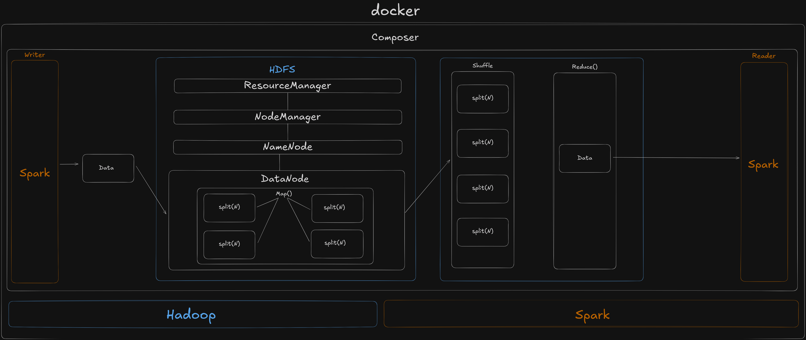
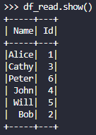
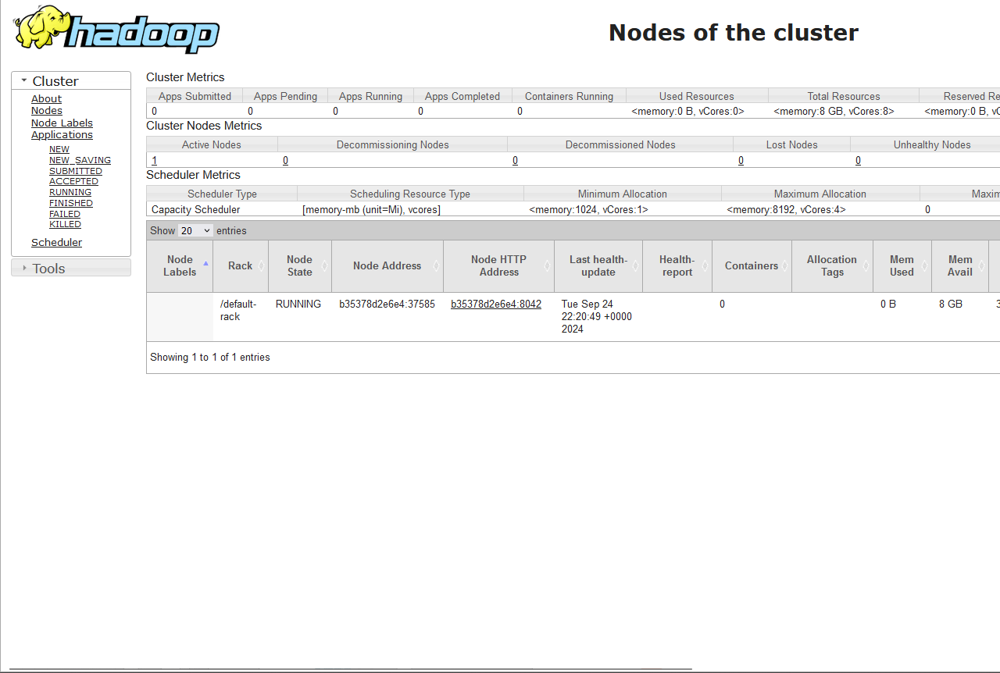
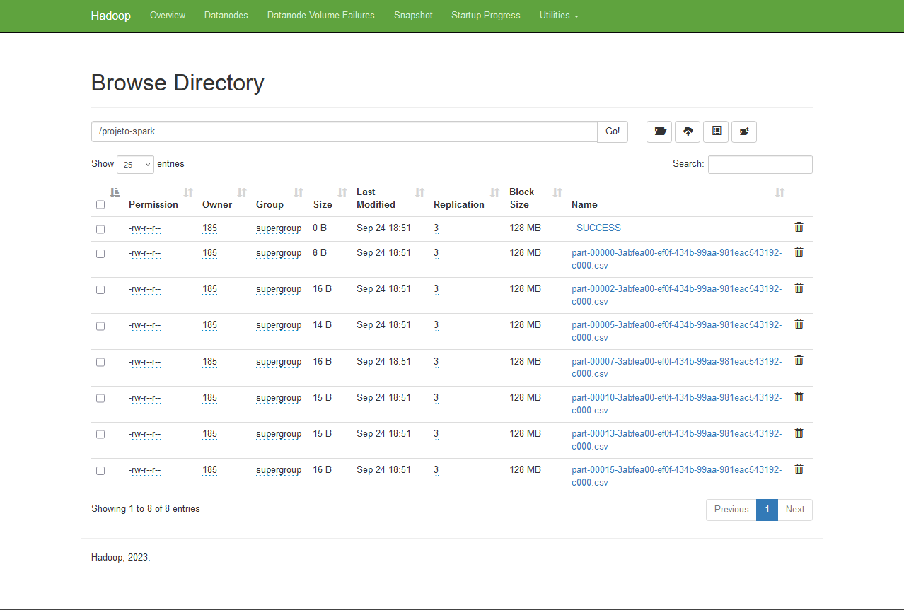
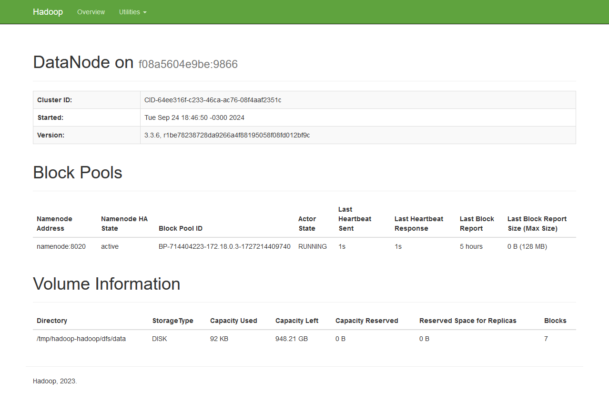

# Hadoop + Spark

### MBA Engenharia de Dados
### Universidade Presbiteriana Mackenzie
### Matéria: Big Data Processing


### Integrantes

|Nome               |
|----               |
|Davi Santos        |
|João Pedro         |
|Mônica Dyna        |
|Kayque Mendes      |
|Vinícius Soares    |


# Proposta

Desenvolver um projeto armazenamento e processamento de dados distribuídos utilizando Hadoop e Spark

    1. Arquitetura
    2. Vantagens e benefícios
    3. Manual de utilização

# Aplicação

Para a resolução da proposta foram utilizadas as ferramentas:
`Docker`, `Hadoop` e `Spark`

Imagine que sua empresa é uma grande cozinha industrial. O Hadoop seria a infraestrutura que organiza e prepara todos os ingredientes, enquanto o Spark seria o chef que utiliza esses ingredientes para criar pratos de maneira rápida e eficiente.

### No mundo real dos dados:

`Hadoop`: é como uma cozinha industrial que gerencia e armazena uma grande quantidade de ingredientes (dados). O HDFS (Hadoop Distributed File System) é a despensa enorme e organizada onde os ingredientes são distribuídos em várias prateleiras, assim como os dados são distribuídos entre os DataNodes. Já o YARN é o gerente da cozinha, que supervisiona os ajudantes de cozinha (processos de computação) e aloca os recursos de acordo com a necessidade de cada pedido (tarefa de processamento).

- `HDFS` 
divide os ingredientes em blocos e os armazena em diferentes despensas (nós), como uma cozinha que divide grandes volumes de ingredientes em porções gerenciáveis, para que a equipe possa acessá-los de forma eficiente.

- `YARN` 
é responsável por coordenar os recursos da cozinha, garantindo que os ajudantes estejam focados em diferentes tarefas de forma coordenada.


`Spark`: É o serviço de coordenação que gerencia o Kafka. Ele mantém o registro de todos os tópicos, partições, brokers (servidores Kafka) e consumidores. O Zookeeper garante que todos os componentes do sistema saibam o que está acontecendo e possam agir de forma coordenada.

- `RDDs`
(Resilient Distributed Datasets) são como bandejas de ingredientes já preparados e prontos para serem usados. Eles são distribuídos pela equipe e podem ser reutilizados várias vezes sem a necessidade de buscá-los na despensa toda vez.

- `transformations` 
são como o preparo de pratos intermediários – por exemplo, cortar vegetais ou preparar o molho – que não servem o cliente diretamente, mas são necessários para criar o prato final.
- `actions` 
As actions são como o momento final de entregar o prato ao cliente, quando o pedido é completo e serve ao propósito final, seja alimentar alguém ou entregar um dado processado.

### Como funciona na prática:

`Coleta de Dados`:
        Os sistemas (aplicativos, sensores, etc.) enviam grandes volumes de dados para o HDFS (Hadoop), que os armazena de forma distribuída e segura.

`Processamento`:
        O Spark se conecta ao HDFS e processa os dados em memória, utilizando RDDs para garantir alta performance em operações distribuídas. O YARN coordena os recursos para garantir a eficiência.

`Transmissão`:
        Os dados processados podem ser armazenados novamente no HDFS ou enviados para bancos de dados, relatórios ou sistemas de machine learning para análise e tomada de decisões.

# Solução

### Requisitos

#### 1. WSL [(Docs)](https://learn.microsoft.com/en-us/windows/wsl/)

O Windows Subsystem for Linux (WSL) é uma funcionalidade do Windows que permite executar distribuições Linux diretamente no sistema operacional da Microsoft


#### 2. Docker [(Docs)](https://docs.docker.com/)

Docker é uma plataforma de software open-source que utiliza a tecnologia de contêinerização para empacotar aplicações e suas dependências em unidades isoladas e portáteis, chamadas de contêineres.

#### 3. Spark [(Docs)](https://spark.apache.org/docs/latest/)

É um motor de processamento de dados rápido e de alta performance, que trabalha principalmente em memória. Ele se conecta ao Hadoop para ler dados do HDFS e processá-los de forma distribuída. O Spark é mais rápido que o Hadoop MapReduce, pois realiza operações em memória, permitindo tanto processamento batch quanto em tempo real.

#### 4. Hadoop [(Docs)](http://apache.github.io/hadoop/)

Plataforma de software de código aberto que permite o armazenamento e processamento distribuído de grandes volumes de dados. Ele utiliza o HDFS (Hadoop Distributed File System) para armazenar os dados em blocos distribuídos por vários nós e o YARN para gerenciar os recursos e agendar as tarefas de processamento.


# Arquitetura




### Vantagens e benefícios

A combinação de Apache Kafka e Zookeeper oferece uma solução robusta e escalável para sistemas de streaming de dados em tempo real. A sinergia entre essas duas tecnologias proporciona uma série de vantagens e benefícios:

#### Hadoop
    . Escalabilidade
    . Armazenamento distribuído e redundância
    . Processamento em larga escala 
    . Resiliência a Falhas

#### Spark
    . Alta performance
    . Múltiplos modelos de processamento 
    . Fácil integração com Hadoop


### Docker
    . Portabilidade
    . Alta Escalabilidade
    . Eficicência


## Manual de Utilização

### 1. Crie um arquivo Docker Compose


```yml
services:
   namenode:
      image: apache/hadoop:3
      hostname: namenode
      command: ["hdfs", "namenode"]
      ports:
        - 9870:9870
      env_file:
        - ./config
      environment:
          ENSURE_NAMENODE_DIR: "/tmp/hadoop-root/dfs/name"
   datanode:
      image: apache/hadoop:3
      command: ["hdfs", "datanode"]
      ports:
        - 9864:9864
      env_file:
        - ./config      
   resourcemanager:
      image: apache/hadoop:3
      hostname: resourcemanager
      command: ["yarn", "resourcemanager"]
      ports:
         - 8088:8088
      env_file:
        - ./config
      volumes:
        - ./test.sh:/opt/test.sh
   nodemanager:
      image: apache/hadoop:3
      command: ["yarn", "nodemanager"]
      env_file:
        - ./config
```

O arquivo define os serviços: 
    
    - namenode
    - datanode
    - resourcemanager
    - nodemanager

E os serviços expõem as portas:

    - namenode:9870
    - datanode:9864
    - resourcemanager:8088


### 2. Inicie o Docker Compose

 Abra o terminal no diretório onde o arquivo `docker-compose.yml` se encontra e execute o comando abaixo para iniciar os contêineres Kafka e Zookeeper:

```
docker-compose up -d
```


### 3. Verifique o status do container

 Verifique se o container está executando rodando o comando abaixo:

```docker
docker ps
```


### 4. Crie uma instância spark

Utilize o comando abaixo para criação de um tópico

````docker
docker run -it --network projeto-spark_default apache/spark-py /opt/spark/bin/pyspark
````

### 5. Crie um Dataset

````python
data = [
    ("Alice",1),
    ("Bob",2),
    ("Cathy",3),
    ("John",4),
    ("Will",5),
    ("Peter",6)
]
````

#### Defina as colunas

```python
columns = ["Name", "Id"]
```

### 6. Crie um dataframe a partir do Dataset

````pyspark
df = spark.createDataFrame(data,columns)
````

### 7. Defina a variável do caminho do HDFS

```python
hdfs_path = 'hdfs://<id-namenode-container>:8020/projeto-spark'
```

### 8. Escreva o dataframe no HDFS
```python
df.write.csv(hdfs_path, header=True)
```

### 9. Leia o dataframe criado no HDFS
```python
df_read = spark.read.csv(hdfs_path, header=True, inferSchema=True)

df_read.show()
```
Resultado:




### 10. Parar e Remover contêineres

Para parar e remover os contêineres Kafka e Zookeeper, execute o comando abaixo:

```
docker-compose down
```
# Painéis

### Painel Hadoop
[(Hadoop)](http://localhost:8088/cluster)



### Painel HDFS

[(HDFS)](http://<id-namenode-container>:9864/datanode.html#tab-overview)



### Painel Datanode

[(Datanode)](http://localhost:9870/explorer.html#/projeto-spark)

